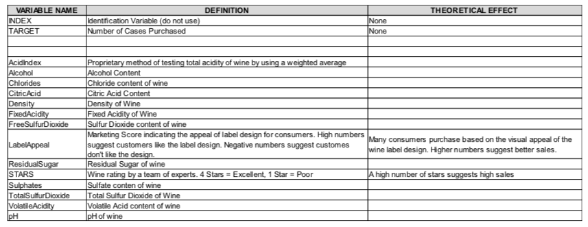

```{r setup, include=FALSE}
knitr::opts_chunk$set(echo = FALSE, message=FALSE, warning=FALSE)
```

### Management summary

This project builds a predictive model that estimates the count of sample cases of wine that were purchased by wine distribution companies after sampling a wine. These cases would be used to provide tasting samples to restaurants and wine stores around the United States. The more sample cases purchased, the more likely is a wine to be sold at a high end restaurant.
After an initial variable inspection, data imputation and transformation, three types of count regression models were prepared and compared on test data: Poisson regression, negative binomial regression, and multiple linear regression. Based on regression performance metrics, the best model was suggested and applied on the evaluation dataset.
  
### 1. DATA EXPLORATION 
  
The training dataset contains 12795 observations of 16 variables (one index, one response, 
and 14 predictor variables).  
Each record (row) represents a range of parameters of a wine type being sold such as its chemical
properties.
The continuous response variable `TARGET` represents the number of cases of wine that are sold as tasting samples to restaurants and wine stores around the United States.

The **variables** are:



```{r message=FALSE}
library(dplyr)
library(tidyr)
library(readr)
library(ggplot2)
library(caret)
library(DataExplorer)
library(gridExtra)
library(ModelMetrics)
library(knitr)

df_raw_train = read.csv("wine-training-data.csv") 
```

#### 1.1. Univariate analysis


```{r eda_charts, include=F}
plot_overview = function(df, x) {
df = data.frame(df)
y = df[,x]

p1 = ggplot(df, aes(x= x, y = y)) + geom_boxplot() + xlab(x) + ylab("value") + 
  ggtitle(x)
p2 = ggplot() + geom_histogram(aes(x=y),na.rm = T) + 
  geom_vline(aes(xintercept=mean(y,na.rm = T)), color = "red",linetype = 2) + xlab(x) +
   ggtitle("")
p3 = ggplot() + geom_point(aes(sample=y), stat = "qq", size = 0.1)
p4 = ggplot()  + geom_density(aes(x=log(y)),na.rm = T) + xlab(paste0("log(",x,")"))

grid.arrange(p1, p2, p3, p4, nrow = 2)
}

plot_target_cor = function(df,x,trg_var_name){

df_cc = df[,c(x,trg_var_name)]
df_cc = as.data.frame(df_cc[complete.cases(df_cc),]) 
trg_cor = cor.test(df_cc[,x],df_cc[,trg_var_name])
# df_cc$x_log = log(df_cc[trg_var_name>0,x])
# trg_log_cor = cor.test(df_cc[df_cc$x_log>0,"x_log"],df_cc[df_cc$x_log>0,trg_var_name])

cor_out = paste("cor:",round(trg_cor$estimate,3),
                "p-val:", ifelse(trg_cor$p.value<0.01,"<0.01",round(trg_cor$p.value,3)))
# cor_out_log = paste("cor (log):",round(trg_log_cor$estimate,3),
#                 "p-val:", ifelse(trg_log_cor$p.value<0.01,"<0.01",round(trg_log_cor$p.value,3)))

x_pos = quantile(df_cc[,x],0.9)
y_pos_0 = quantile(df_cc[,trg_var_name],0.006)
y_pos_1 = quantile(df_cc[,trg_var_name],0.004)

p = ggplot(data = df_cc, aes_string(x=x,y=trg_var_name)) +
  geom_point(size=1, alpha = 0.5) + geom_smooth(method = "loess") +
  annotate("text", x = x_pos, y = y_pos_0,label = cor_out,size=3) +
  # annotate("text", x = x_pos, y = y_pos_1,label = cor_out_log, size=3) +
  ylab(trg_var_name) + ggtitle(paste(x,"vs",trg_var_name))

grid.arrange(p,nrow = 1)
}

plot_overview_target = function(df,x,trg_var_name){
  grobs = list(plot_overview(df,x),plot_target_cor(df,x,trg_var_name))
  grid.arrange(grobs = grobs, nrow = 2,widths=c(4,4), 
               top = paste(x,"overview and correlation vs.",trg_var_name))
}
```


```{r model metrics, include=F}
# Model metrics functions for GLM and linear model
explained_variance = function(mod){1 - mod$deviance/mod$null.deviance}

glm_performance = function(mod,actual){
  
  exp_var_ = explained_variance(mod)
  rmse_ = rmse(actual = actual,predicted = mod$fitted.values)
  return(data.frame("Model" = deparse(substitute(mod)), 
                    "Explained Variance" = exp_var_,"RMSE"=rmse_))
}

lm_performance = function(mod, actual){

  adjrsq_ = summary(mod)$adj.r.squared
  rmse_ = rmse(actual = actual,predicted = mod$fitted.values)
  return(data.frame("Model" = deparse(substitute(mod)), 
                    "Adj. R-Squared" = adjrsq_,"RMSE"=rmse_))
}

# Function for variable importance
rank_var_imp = function(mod) {
  tmp = summary(mod)
  coefs_ = round(tmp$coefficients[,1],5)
  test_stat_prob_ = round(tmp$coefficients[,4],5)
  vars_ = names(coefs_)
  
  out = data_frame("Variable" = vars_,"Coefficient" = coefs_, "ConfLevel" = 1-test_stat_prob_) %>% 
    filter(ConfLevel > 0.95) %>% arrange(desc(abs(Coefficient)))
  
  return(out)
}

```


Summaries for the individual variables are provided below.  
```{r}

summary(df_raw_train)

df = df_raw_train %>% select (-INDEX)
```

```{r}
plot_missing(df_raw_train, title = "Percentage of missing data per variable")
```
  
From the summaries and the chart above we can see that all variables are continuous and that multiple variables have missing data, but the amount of NAs is not very high with the exception of the `STARS` variable. 

A check for near-zero variance did not show a positive result for any variable.

```{r,eval=FALSE, include=F}
# Check for NZV

nzv = nearZeroVar(df, saveMetrics= TRUE)
knitr::kable(nzv)
```


Per-variable distribution analysis is provided below (excluding the `INDEX` variable, which is immaterial to the analysis and would not be regarded further).
  
  
```{r}
trg_var = "TARGET"
pred_vars = setdiff(names(df),trg_var)

for (i in names(df)){
  plot_overview(df=df,x = i)
}
```

Summary of the findings from the univariate analysis:
  
* The `TARGET` variable is a count variable valued between 0 and 8, approximately normally distributed, but with a zero-inflated tail  
* Most of the predictor variables, with the exception of `STARS`, and `AcidIndex` are symmetrically distributed around zero, which is likely due to a problem with the input data, as these variables should not take negative values.  
 
    
#### 1.2. Bivariate analysis
  
The pairwise correlations between the continuous variables are displayed below

```{r}
## View correlation of all continuous varaibles (for complete cases)

plot_correlation(df,use="pairwise.complete.obs",type = "continuous",
                 title = "Pairwise correlations between continuous variables")
```

The pairwise scatterplots of the most highly correlated variables vs. the response are provided below

```{r}

cor_vars = c("STARS", "AcidIndex", "LabelAppeal", "VolatileAcidity", "Alcohol")

for (i in cor_vars){
  plot_target_cor(df = df[complete.cases(df),], x=i,trg_var_name ="TARGET")
}


```
  
Summary of the findings from the univariate analysis:
  
1) Most of the variables are uncorrelated with the response, and only a few show moderate correlations with `TARGET`, namely: `STARS`, `AcidIndex`, `LabelAppeal`, `VolatileAcidity`, and `Alcohol`.
2) There is virtually no collinearity between the predictors (with the exception of `STARS` and `LabelAppeal` (r=+0.33), where it is not strong enough to cause concern)


### 2. DATA PREPROCESSING  
  
### 2.1. Data cleaning

The exploratory analysis shows that the distributions of many predictors are suspiciously symmetrical around zero. Moreover, these predictor variables cannot physically be negative (e.g. a wine cannot have a negative alcohol or chloride content).  
Therefore, we shall test if the negative sign represents an error in the data entry and can be ignored without losing the correlations in the dataset.

A correlation plot below shows the pairwise correlations in the data where the absolute values were taken for the columns: `FixedAcidity`, `VolatileAcidity`, `CitricAcid`, `ResidualSugar`, `Chlorides`, `FreeSulfurDioxide`,  `TotalSulfurDioxide`, `Sulphates`, `Alcohol`.

```{r}
df_transformed = df %>% mutate_at(c(2:12,14),.funs = abs)
plot_correlation(df_transformed,use="pairwise.complete.obs",type = "continuous",
                 title = "Pairwise correlations between continuous variables (transformed)")
```
  
We can see comparing to the previous chart that the pairwise correltaion coefficients have hardly changed and have not changed their direction, which confirms the idea of a minus sign being a data entry error.  
As an example, compare the scatterplot of `Alcohol` vs the `TARGET` for raw and absolute values (a random sample of 5000 observations is displayed):
  
```{r}

set.seed(123)
row_samp = sample(nrow(df[complete.cases(df$Alcohol),]), 5000,replace = F)

g1 = ggplot(df[row_samp,], aes(Alcohol, TARGET)) + 
  geom_point() + geom_smooth(method = "lm") + ggtitle("Alcohol vs. TARGET")
g2 = ggplot(df_transformed[row_samp,], aes(Alcohol, TARGET)) + 
  geom_point() + geom_smooth(method = "lm") + ggtitle("abs(Alcohol) vs. TARGET")

grid.arrange(g1,g2, nrow = 1, ncol=2)
```
  
We can clearly see that removing the minus sign simply shifts the distribution of the `Alcohol` variable along the X axis and does not affect the relationship with the response variable.

### 2.2. Data imputation

As shown at the beginning of the exploratory analysis, several variables have missing data.
The missing values are imputed using the functions of the **mice** package.
  
The chart below shows the density of the imputed data for each variable is showed in magenta while the density of the observed data is showed in blue. We can see that the imputation does not result in a very different distribution and can thus proceed with the imputed dataset.

```{r echo=F, message=F, warning=F, output='hide'}
# Impute the columns with missing values

# install.packages("mice")
library(mice)

plot_missing(df_transformed)

df_missing_cols = df_transformed[,c("pH","ResidualSugar","Chlorides","FreeSulfurDioxide","Alcohol",
                                    "TotalSulfurDioxide","Sulphates","STARS")]
df_imp_cols_tmp = mice(data = df_missing_cols, m = 1, method = "pmm", maxit = 10, seed = 500)
df_imp_cols = complete(df_imp_cols_tmp)
df_imp = bind_cols(df_transformed %>% 
                     select(-pH, -ResidualSugar, -Chlorides, -FreeSulfurDioxide
                            , -Alcohol,-TotalSulfurDioxide, -Sulphates, -STARS)
                   ,df_imp_cols)
```

```{r imputed-plot}
# Plot the imputed vs observed distributions
densityplot(df_imp_cols_tmp)
```

### 2.3. Data transformation: Box-Cox Method

From the density plots below we can also see that after the transformation and imputation several predictors do not show a normal distribution. 

```{r}
plot_density(df_imp %>% sample_frac(0.5))
```
  
After iterating on power transformations, the following predictors were transformed using the Box-Cox method: `FixedAcidity`, `VolatileAcidity`, `CitricAcid`, `TotalSulfurDioxide`, `Sulphates`.   
The $\lambda$ values applied are shown in the table below.


```{r cache=T}
# Apply Box-Cox transformation to normalize the predictors
library(geoR)

df_imp_bc_cols = df_imp[,c("FixedAcidity", "VolatileAcidity", "CitricAcid", "TotalSulfurDioxide", "Sulphates")]

bc_transform = function(x) {
  lambda = boxcoxfit(x + 0.0001)$lambda # adding 10^(-4) to make zero values positive 
  return(x^lambda)
}

bc_lambda = function(x) {
  lambda = boxcoxfit(x + 0.0001)$lambda # adding 10^(-4) to make zero values positive 
  return(lambda)
}


df_imp_bc_cols = df_imp_bc_cols %>% 
  transmute_all(.funs = bc_transform)


df_imp_final = bind_cols(df_imp %>% 
                     select(-FixedAcidity, -VolatileAcidity, -CitricAcid,
                            -TotalSulfurDioxide,-Sulphates)
                   ,df_imp_bc_cols)

df_bc_lambdas = df_imp_bc_cols %>% summarise_all(.funs = bc_lambda)

kable(df_bc_lambdas, caption = "Lambda coefficients for the Box-Cox transformation")

```

Plotting the distributions of the Box-Cox transformed variables, we can see the that their distributions have become closer to normal. 

```{r}
plot_density(df_imp_bc_cols %>% sample_frac(0.5))
```

This has resulted in improved correlation with the response for the transformed variables, as displayed in the plot below.
  
```{r}
plot_correlation(df_imp_final)
```
  

### 3. BUILD MODELS

In this step, multiple regression models are be built to predict the `TARGET` count of wine cases ordered. 

The models are built on the 80% sample of the training data, and the remaining 20% are used to assess the model performance on out-of-sample data in order to avoid choosing an overfitting model as the best model.
The model performance will be compared to each other using RMSE as a metric of prediction quality. 

```{r split data}

set.seed(123) 

# # Split into training and test
df_index = createDataPartition(df_imp_final$TARGET, p = .8, list = FALSE)

df_train = df_imp_final[ df_index, ]
df_test = df_imp_final[-df_index, ]

```

### 3.1. Build poisson regression models 
  
Poisson regresison models count data. We build two models: the full model, and a model with the following set of predictors that showed at least moderate correlation with the response: `LabelAppeal`, `STARS`, `AcidIndex`, `VolatileAcidity`, `TotalSulfurDioxide`, `Alcohol`. This subset covers both the bottle appeal, the taste rating, and some of the main chemical properties of a wine.


#### 3.1.1. Poission model 1: Full Model  
  
```{r}
poisson_full = glm(TARGET ~  ., data=df_train, family=poisson)
```

The model in-sample performance is provided below.

**Model summary and performance**

```{r}
summary(poisson_full) 
```

```{r cache=T}
plot(poisson_full)
```


```{r}
kable(glm_performance(poisson_full,df_train$TARGET))
```

  
From the model summary and the diagnostic plot we can see the following:  
1) The errors are not quite normally distributed  
2) Several variables are not significant
  
**Interpretation of the regression coefficients for the significant variables**  
  
The model coefficients (only statistically significant ones) ranked by descending magnitude are provided in the table below.

```{r}
kable(rank_var_imp(poisson_full))
```

We can interpret the model coefficients as follows:  
- `VolatileAcidity`, `AcidIndex`, `Sulphates`, and `Chlorides` have the strongest negative impact on the response variable. All of these variables describe taste parameters of a wine. The interpretation of their negative impact is that high concentrations of individual components are detrimental to the overall taste. 
- `LabelAppeal`, `STARS`, and `CitricAcid` have a positive impact on the number of ordered cases. This confirms the idea that bottle design and expert rating positively impact wine sales. Citric acid in small quantities can add citrus notes to wine taste, and is sometimes added to enhance the taste. This can be an explanation of a positive effect this variable has on the number of orders.
- While statistically significant, the `Alcohol` content of a wine has no pratically relevant effect on the number of ordered cases.


#### 3.1.2. Poisson model 2 (Manually reduced set of variables)
  
For the second model, only the following variables are considered:  
`LabelAppeal`, `STARS`, `AcidIndex`, `VolatileAcidity`, `TotalSulfurDioxide`, `Alcohol`.

  
**Model summary and performance**

```{r p_m2}
poisson_reduced = glm(TARGET ~  LabelAppeal+STARS+AcidIndex+VolatileAcidity+
                     TotalSulfurDioxide+Alcohol, data=df_train, family=poisson)
```

```{r}
summary(poisson_reduced)
```


```{r}
kable(glm_performance(poisson_reduced,df_train$TARGET))
```
  
Looking at the model summary and performance on the in-sample data we can see that now all coefficients are highly significant, and the explained variance is reduced only slightly (from 18.35% in the full model to 18.14% in the reduced model), while RMSE stayed virtually the same.
  
**Interpretation of the regression coefficients for the significant variables**  

```{r}
kable(rank_var_imp(poisson_reduced))
```

The interpretation of the coefficients, their direction and magnitude have stayed the same as in the full model.
  
  
  
### 3.2. Build negative binomial regression models
  
Negative binomial regression can be used for over-dispersed count data, that is when the conditional variance exceeds the conditional mean. It can be considered as a generalization of Poisson regression since it has the same mean structure as Poisson regression and it has an extra parameter to model the over-dispersion.[1]  
The difference to the Poisson models built above would be in the confidence intervals for the regression coefficients. 


#### 3.2.1. Negative binomial model 1 (Manually reduced)  
  
The first negative binomial model considered is a reduced version of the full model where the following variables - the ones not found significant in the full poisson model - are excluded:
`Density`, `ResidualSugar`, `FreeSulfurDioxide`, and `FixedAcidity`.

```{r}
library(MASS)
nb_1 = glm.nb(TARGET ~ . -Density -ResidualSugar -FreeSulfurDioxide -FixedAcidity, data=df_train)

```

The model in-sample performance is provided below.

**Model summary and performance**

```{r}
summary(nb_1)
```


```{r}
kable(glm_performance(nb_1,df_train$TARGET))
```

As expected, all coefficients provided by the model are statistically significant and are close to the ones estimated by the full poisson model. Model performance is also close to that of the full poisson model.
  
**Interpretation of the regression coefficients for the significant variables**  
  
The model coefficients (only statistically significant ones) ranked by descending magnitude are provided in the table below.

```{r}
kable(rank_var_imp(nb_1))
```

We can see that the coefficients for the shared variables between this reduced negative binomial and the full poisson model are only slightly different, which is caused by the absence of several predictors in this model vs. the full model.  
The interpretation of the coefficients, their direction and magnitude have stayed the same as in the full model.


#### 3.2.2. Negative binomial model 2 (Only two predictors) 
  
The second negative binomial model is considering only two predictors that are measurable without a chemical analysis of a wine: `STARS` and `LabelAppeal`. The goal of building this model is to test it against the first negative binomial model to assess if the chemical composition predictors play an important role.

```{r}
library(MASS)
nb_2 = glm.nb(TARGET ~ STARS + LabelAppeal, data=df_train)

```

The model in-sample performance is provided below.

**Model summary and performance**

```{r}
summary(nb_2)
```


```{r}
kable(glm_performance(nb_2,df_train$TARGET))
```

We can see a reduction in the explained variance in this model vs. the first one (from 18.3% to 13.2%), and a growth of the RMSE.
In order to confirm the significance of the chemical variables to the model, we compare the two models using an Likelihood Ratio Test (as the second negative binomial model is nested in the first one) [1,2].

```{r}
anova(nb_2,nb_1)
```

From the output we can see that the Likelihood Ratio statistic is very significantly different from zero for the model with more predictors (Probability(LR Stat = 938.57 | LR Stat = 0) = 0).
This means that the chemical variables carry relevant information for the prediction of the response.
  
**Interpretation of the regression coefficients for the significant variables**  
  
The model coefficients (only statistically significant ones) ranked by descending magnitude are provided in the table below.

```{r}
kable(rank_var_imp(nb_2))
```

Interestingly, the coefficient for the `STARS` and `LabelAppeal` variables are only slightly different from the first negative binomial model.  
The interpretation of the coefficients, their direction and magnitude have stayed the same as in the full poisson model.

### 3.3. Build multiple linear regression models
  
In order to test if the poisson model (log link function) is really the best choice of modeling the relationship between the predictors and the response, we will test two linear models: a full model, and a model that is automatically selected using stepwise backwards approach.   

#### 3.3.1. Multiple linear model 1 (full model)  
  
```{r}
lm_full = lm(TARGET ~ . , data=df_train)

```

The model in-sample performance is provided below.

**Model summary and performance**

```{r}
summary(lm_full)
```
  
From the model summary we can see that almost the same variables are not significant for the linear model as for the poisson model.


```{r}
kable(lm_performance(lm_full,df_train$TARGET)) 
```

We can see that while the Adjusted R-Squared metric (26.5%) appears higher than the explained deviance of the poisson/negative binomial models, the RMSE of the linear model shows a higher error on the in-sample data.
  
**Interpretation of the regression coefficients for the significant variables**  
  
The model coefficients (only statistically significant ones) ranked by descending magnitude are provided in the table below.

```{r}
kable(rank_var_imp(lm_full))
```

The coefficients provided by the linear model are different, as they relate predictors directly to the values of `TARGET` vs. via an exponent, as in the poisson model. However, the order of importance, the direction and relative magnitudes of the coefficients allow to make the same conclusions as in the full poisson model. 


#### 3.3.2. Multiple linear model 2 (Stepwise selection) 
  
The second linear model is built using an automated stepwise model selection approach in which all non-significant predictors are eliminated. 
The eliminated predictors are shown in the table below.

```{r}
library(leaps)
lm_stepwise = regsubsets(TARGET~., data=df_train,nvmax = 10,method = "backward")

rs =summary(lm_stepwise)

step_preds = data.frame(rs$which [which.max(rs$adjr2),])
step_preds$Variable = row.names(step_preds)
names(step_preds) = c("Relevant.Predictor","Variable")
kable(as.tbl(step_preds[,c(2,1)]) %>% arrange(Relevant.Predictor))
```

The resulting linear model excludes the following predictors: `Density`, `ResidualSugar`, `FreeSulfurDioxide`, and `FixedAcidity`.

```{r}
lm_stepwise = lm(TARGET ~ . - Density -ResidualSugar -FreeSulfurDioxide -FixedAcidity, 
                 data= df_train)
```

The model in-sample performance is provided below.

**Model summary and performance**

```{r}
summary(lm_stepwise)
```
  
From the model summary we can see that almost the same variables are not significant for the linear model as for the poisson model.


```{r}
kable(lm_performance(lm_stepwise,df_train$TARGET)) 
```

We can see that while the Adjusted R-Squared and RMSE metrics have hardly moved vs. the full model indicating that the excluded predictors did not add any additional explanatory power to the model.
  
**Interpretation of the regression coefficients for the significant variables**  
  
The model coefficients (only statistically significant ones) ranked by descending magnitude are provided in the table below.

```{r}
kable(rank_var_imp(lm_stepwise))
```

The direction and interpetation of the coefficients is the same as in the full linear model.


### 4. MODEL SELECTION
  
In this step, the performance of all six models is be compared based on RMSE on the out-of sample data. The best performing model is chosen as the final one.

```{r}
poisson_full_pred = predict(poisson_full, df_test,type = "response")
poisson_reduced_pred = predict(poisson_reduced, df_test,type = "response")
nb_1_pred = predict(nb_1, df_test,type = "response")
nb_2_pred = predict(nb_2, df_test,type = "response")
lm_full_pred = predict(lm_full, df_test,type = "response")
lm_stepwise_pred = predict(lm_stepwise, df_test,type = "response")

```

```{r}

rmse_result = data.frame("model" = c("Poisson full", "Poisson reduced",
                                     "Neg. binom. 1 (large)", "Neg. Binom 2 (2 variables)",
                                     "Linear full", "Linear stepwise reduced"))
rmse_result$RMSE = c(
  rmse(poisson_full_pred,df_test$TARGET),
  rmse(poisson_reduced_pred,df_test$TARGET),
  rmse(nb_1_pred,df_test$TARGET),
  rmse(nb_2_pred,df_test$TARGET),
  rmse(lm_full_pred,df_test$TARGET),
  rmse(lm_stepwise_pred,df_test$TARGET))


knitr::kable(rmse_result)
```

We can see that on out-of-sample data, the linear model with the automatically selected set of predictors has performed on par with the full linear and full poisson models. 

Comparing the fitted values against test data we can see that the linear model is fairly constant in the errors at each level of the response. However, it fails to capture the highest levels (count of 7 and 8 cases). The poisson model has a visibly higher error on the zero count of the response, but does provide several predictions for the highest levels of demand.

```{r}
par(mfrow=c(1,2))
plot(lm_stepwise_pred,df_test$TARGET,main="Linear stepwise reduced model",xlab = "fitted value", ylab="actual value")
plot(poisson_full_pred,df_test$TARGET,main="Poisson full model",xlab = "fitted value", ylab="actual value")

par(mfrow=c(1,1))
```
  

Due to its simplicity in terms of the number of predictors and the interpretation, the reduced linear model is chosen as the best one for generating predictions on the evaluation data set.

The model formula is:
*TARGET ~ (Density + LabelAppeal + AcidIndex + pH + ResidualSugar + Chlorides + FreeSulfurDioxide + Alcohol + STARS + FixedAcidity + VolatileAcidity + CitricAcid + TotalSulfurDioxide + Sulphates)*
  

However, further tuning of the negative binomial family models (e.g. using zero-inflated model) could provide better precision of the predictions, especially for the lower end of the distribution of the target variable.

**Predictions on the evaluation dataset**  
  
The evaluation dataset is transformed in the same way as the training dataset in order to provide correct predictions.
NA values in the evaluation data will cause missing predictions.

```{r}
# Read and transform the evaluation dataset
df_eval = read_csv("wine-evaluation-data.csv")

# Drop index and transform to absolute values
df_eval_trans = df_eval[,2:16]
df_eval_trans = df_eval_trans %>% mutate_at(c(2:12,14),.funs = abs)

# Box-Cox transformation 

df_eval_trans = df_eval_trans %>% 
  mutate(FixedAcidity = FixedAcidity^( 0.9616419),
         VolatileAcidity = VolatileAcidity^(1.110294),
         CitricAcid = CitricAcid^(0.9378151),
         TotalSulfurDioxide = TotalSulfurDioxide^(0.9779128),
         Sulphates = Sulphates^(1.002414)
         )

```

  
Predictions on the evaluation dataset are made using the model *lm_stepwise*.

```{r}

eval_predict = predict(lm_stepwise,data.frame(df_eval_trans),type = "response")
eval_out = data.frame(eval_predict)
write_csv(data.frame(eval_predict),"wine-evaluation_predictions.csv")

```

The output of the model on the evaluated data is available under the following URL:
[]()

### Appendix

The full R code for the analysis in Rmd format is available under the following URL:
[]()


### Reference
  
1. Negative Binomial Regression | R Data Analysis Examples. UCLA: Statistical Consulting Group.  https://stats.idre.ucla.edu/r/dae/negative-binomial-regression/ (Accessed on May 12, 2018).
2. Faraway, J. J. (2006). Extending the linear model with R: Generalized linear, mixed effects and nonparametric regression models.